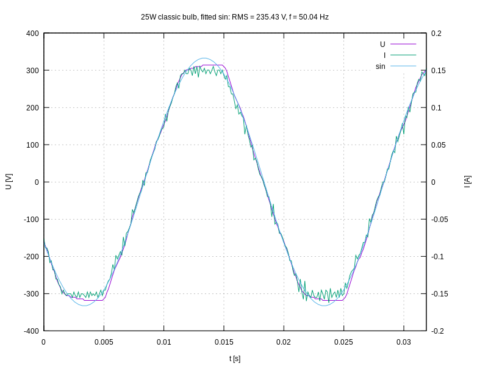

## Yet another library that talks to [mooshimeter](http://moosh.im)

Written in C++. Requires Linux. Tested on desktops and Raspberry Pi.

Object instantiation of Mooshimeter class establishes connection with the
meter. Constructor has six arguments:

```c++
Mooshimeter(const char* hwaddr, uint16_t hin, uint16_t hout,
  std::function<void(const Measurement&)> measurement,
  std::function<void(const Response&)> others,
  bool verbose=false);
```
**hwaddr** is an address of the mooshimeter, **hin** and **hout** are handles
corresponding to input and output streams respectively. Library does not scan
for available devices nor read characteristics to discover handles. One can
obtain necessary values with **hcitool** and **gatttool** commands. Detailed
instructions are given in **mooshimeter.h** file.

**measurement** is a function that is called every time complete measurement
has been read. Function is called from reader thread context. (Library uses
three additional threads.)

**others** is a function that is called for responses that do not belong to
measurement data: battery status, logging status etc. Function is called from
reader thread context.

Setting **verbose** to true will print all sent and received packets to output
stream.

Mooshimeter class offers two methods.

```c++
std::future<std::string> cmd(std::string cmd);
```

Sends command to the mooshimeter. Returns future object which allows to obtain
result. Function is non-blocking and thread safe.

```c++
const ConfigTree& get_config_tree();
```

Returns configuration tree data in read-only mode.

As mentioned above, library is multithreaded. Objects of
**StdOutExclusiveAccess** class are used to avoid data races when printing to
output and error streams.

There are three examples included.

* app1

  Configures the mooshimeter (channel 1: voltage 600V, channel 2: current
  10A), computes and prints values of arithmetic mean, root square mean, real
  power for 15 seconds. Load is resistive - a classic 25W bulb. Alternating
  current had nominal frequence 50 Hz and voltage 230 V.

  ```bash
  % app1
     DATE        TIME             I [A]              U [V]          POWER     V_BAT
                              MEAN      RMS      MEAN      RMS
  2017-04-20 15:30:34.525    -0.001    0.113    -2.139  233.767    26.366       nan
  2017-04-20 15:30:35.068    -0.001    0.113    -2.238  233.685    26.340       nan
  2017-04-20 15:30:35.608    -0.001    0.113    -2.155  234.130    26.393       nan
  2017-04-20 15:30:36.148    -0.001    0.113    -2.152  234.331    26.427       nan
  2017-04-20 15:30:36.688    -0.001    0.113    -2.215  234.051    26.404       nan
  2017-04-20 15:30:37.228    -0.001    0.113    -2.150  234.306    26.440       nan
  2017-04-20 15:30:37.769    -0.001    0.113    -2.132  234.143    26.413       nan
  2017-04-20 15:30:38.311    -0.001    0.113    -2.200  234.062    26.370       nan
  2017-04-20 15:30:38.851    -0.001    0.113    -2.231  234.268    26.404       nan
  2017-04-20 15:30:39.396    -0.001    0.113    -2.136  234.294    26.411       nan
  2017-04-20 15:30:39.937    -0.001    0.113    -2.145  234.061    26.374       nan
  2017-04-20 15:30:40.479    -0.001    0.113    -1.980  234.013    26.399       nan
  2017-04-20 15:30:40.943    -0.001    0.113    -2.052  234.045    26.383     2.996
  2017-04-20 15:30:41.484    -0.001    0.113    -2.115  234.049    26.383     2.996
  2017-04-20 15:30:42.026    -0.001    0.113    -2.312  234.314    26.424     2.996
  2017-04-20 15:30:42.568    -0.001    0.113    -2.118  234.083    26.388     2.996
  2017-04-20 15:30:43.111    -0.001    0.113    -2.133  233.886    26.372     2.996
  2017-04-20 15:30:43.651    -0.001    0.113    -2.200  234.058    26.368     2.996
  2017-04-20 15:30:44.191    -0.001    0.113    -2.174  233.674    26.344     2.996
  2017-04-20 15:30:44.731    -0.001    0.113    -2.158  233.553    26.291     2.996
  2017-04-20 15:30:45.273    -0.001    0.113    -2.234  233.565    26.305     2.996
  2017-04-20 15:30:45.814    -0.001    0.113    -2.152  233.552    26.299     2.996
  2017-04-20 15:30:46.356    -0.001    0.113    -1.916  233.719    26.305     2.996
  %
  ```

* app2

  Configures the mooshimeter (channel 1: voltage 600V, channel 2: current
  10A), takes a single measurement and creates a plot using
  [gnuplot](http://gnuplot.info).

  

* app3

  Updates mooshimeter clock.
